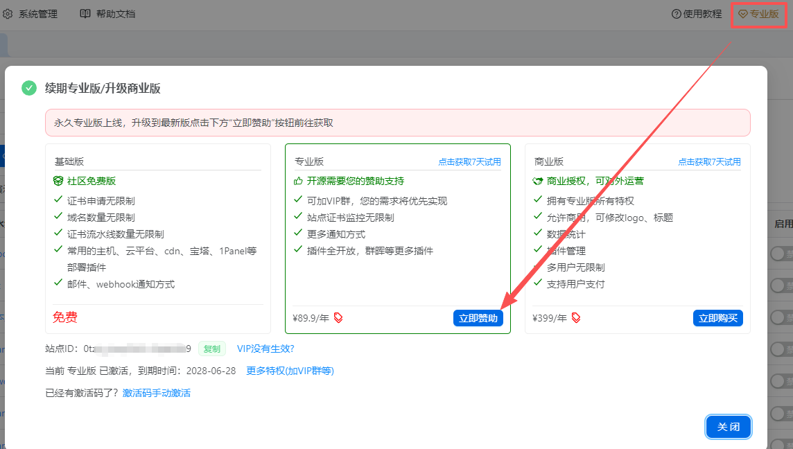
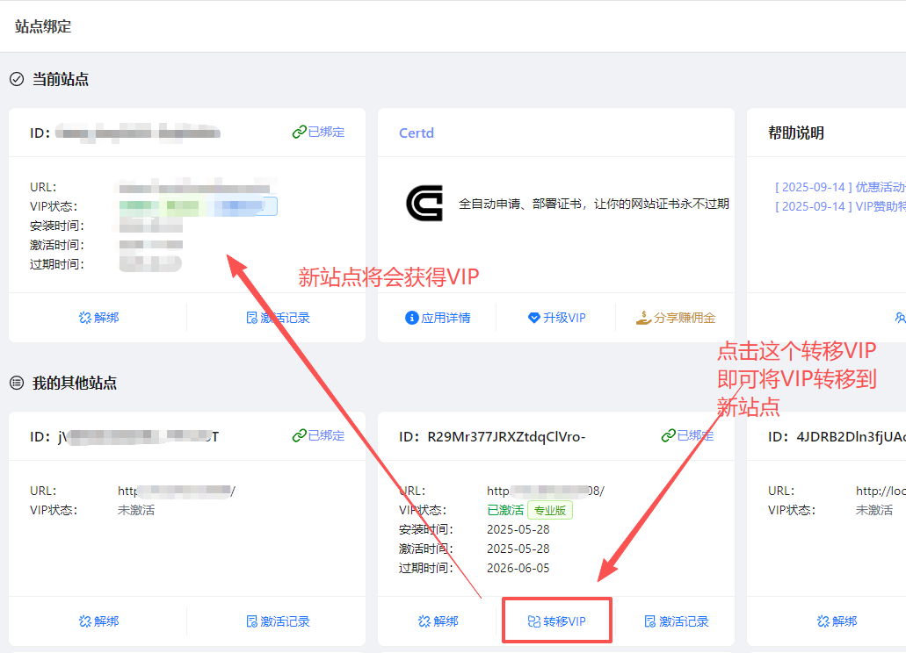

# 专业版赞助

## 开源为什么要做专业版收费？
1. 纯靠为爱发电不可持续，容易烂尾（比如：我的dev-sidecar项目即便是拥有20K+star，也差点凉凉，幸亏有另外大佬接手用爱发电）    
2. 没有赞助的项目，作者会比较任性，不会用心倾听用户的心声，不顾用户体验（比如：下意识拒绝需求、频繁破坏性变更升级、全盘推倒重来之类的） 
3. 没有赞助的项目，交流群的戾气有时候比较重，容易起冲突        

## 赞助权益：
1. 可加入专属VIP群，可以获得作者一对一技术支持，必要时可以远程协助
# 专业版赞助

## 开源为什么要做专业版收费？
1. 纯靠为爱发电不可持续，容易烂尾（比如：我的[dev-sidecar项目](https://github.com/docmirror/dev-sidecar)即便是拥有20K+star，也差点凉凉，幸亏有另外大佬接手用爱发电）    
2. 没有赞助的项目，作者会比较任性，不会用心倾听用户的心声，不顾用户体验（比如：下意识拒绝需求、频繁破坏性变更升级、全盘推倒重来之类的） 
3. 没有赞助的项目，交流群的戾气有时候比较重，容易起冲突        

## 赞助权益：
1. 可加入专属VIP群，可以获得作者一对一技术支持，必要时可以远程协助
2. 您的需求我们将优先实现，并且将作为专业版功能提供
3. 获得专业版功能

****------------------****
> [限时¥50永久专业版优惠券，点我立刻领取](https://app.handfree.work/subject/#/app/certd/product)

****------------------****
## 专业版特权对比

| 功能&nbsp;&nbsp;&nbsp;&nbsp;&nbsp;&nbsp;          | 免费版                                   | 专业版                     |
|---------|---------------------------------------|--------------------------------|
| 证书申请  | 无限制                        | 无限制                      |
| 证书域名数量      | 无限制                           | 无限制           |
| 证书流水线条数 | 无限制                           | 无限制                          |
| 自动部署插件  | 阿里云CDN、腾讯云、七牛CDN、主机部署、宝塔、1Panel等大部分插件     |     群晖、威联通、proxmox等  |
| 通知         | 邮件通知、自定义webhook            | 邮件免配置、企微、钉钉、飞书、anpush、server酱等 |
| 站点监控  | 限制1条                           | 无限制                          |
| 批量操作      | 无                               | 流水线模版，流水线复制，批量运行，批量设置通知、定时等 |
| VIP群        | 无                               | 可加，一对一技术支持，必要时可申请远程协助  |

## 专业版激活方式

## 相关问题

### 1. 购买后VIP状态或时长未更新
系统管理-->账号绑定页面，打开一下即可自动更新VIP最新状态（如果未登录袖手账号需要先登录）

### 2. 开发票
联系我们(微信：xiaojunnuo)，并提供支付金额

### 3. VIP是否可以迁移换绑服务器？
可以的。
* 方式1. 直接将备份数据在新服务器上还原即可（首次访问会提示您是否绑定新url，点击是即可）
* 方式2. 如果旧站点数据丢失，您也可以部署一个新站点，然后在系统管理-->账号绑定页面，转移VIP即可

