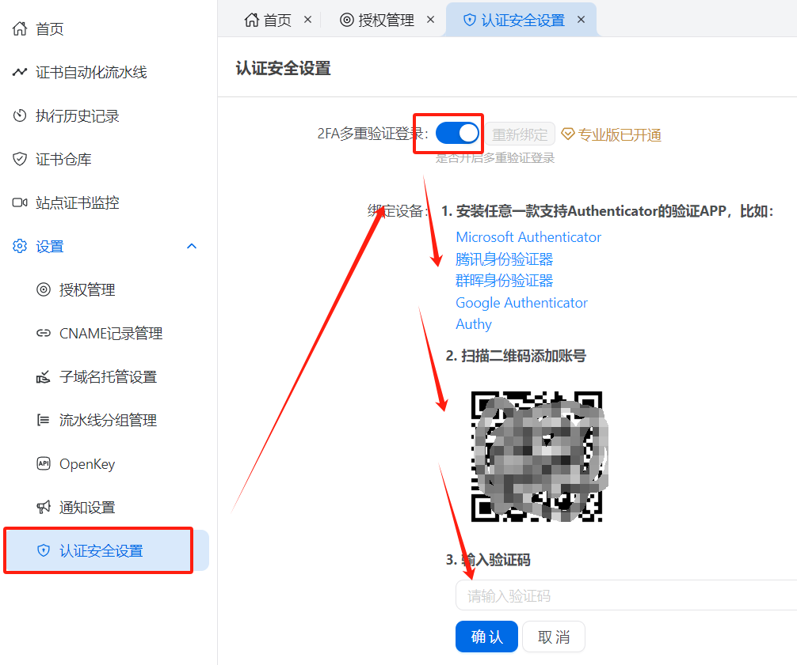

# 安全特性

Certd 存储了证书以及授权等敏感数据，所以需要严格保障安全。      
我们提供了以下安全特性，以及安全生产建议（请遵照建议进行生产部署以保障数据安全）

## 一、站点安全特性

### 1、 授权数据加密存储【默认开启】
* 所有的授权敏感字段会加密后存储
* 每个用户独立维护授权数据，连管理员都无权查看

星号部分为加密数据

### 2、 密码防爆破【默认开启】
* 登录失败次数过多，账号将被锁定，最高24小时(重启服务可解除锁定)
* 用户登录密码加密hash后存储，无法计算出密码明文
  

### 3、站点隐藏【建议开启】
* 一般来说Certd设置好之后，后续很少需要访问修改。
* 所以我们平时可以把站点访问关闭，需要的时候再打开，减少站点被攻击的风险    
* 请前往 `系统管理->系统设置->安全设置->开启站点隐藏`
  

点击查看 [站点隐藏功能详细使用说明](./hidden/)

### 4、登录双重验证

支持2FA双重认证

### 5、数据库自动备份【建议开启】
* [自动备份设置说明](../../use/backup/)

## 二、安全生产建议

尽管`Cert`本身实现了很多安全特性，但`外部环境的安全`仍需要您来确保。    
请`务必`遵循如下建议做好安全防护

* 请`务必`使用`HTTPS协议`访问本应用，避免被中间人攻击
* 请`务必`使用`web应用防火墙`防护本应用，防止XSS、SQL注入等攻击
* 请`务必`做好`服务器本身`的安全防护，防止数据库泄露
* 请`务必`做好[`数据备份`](../../use/backup/)，避免数据丢失
* 建议开启[`站点隐藏`](./hidden/)功能
