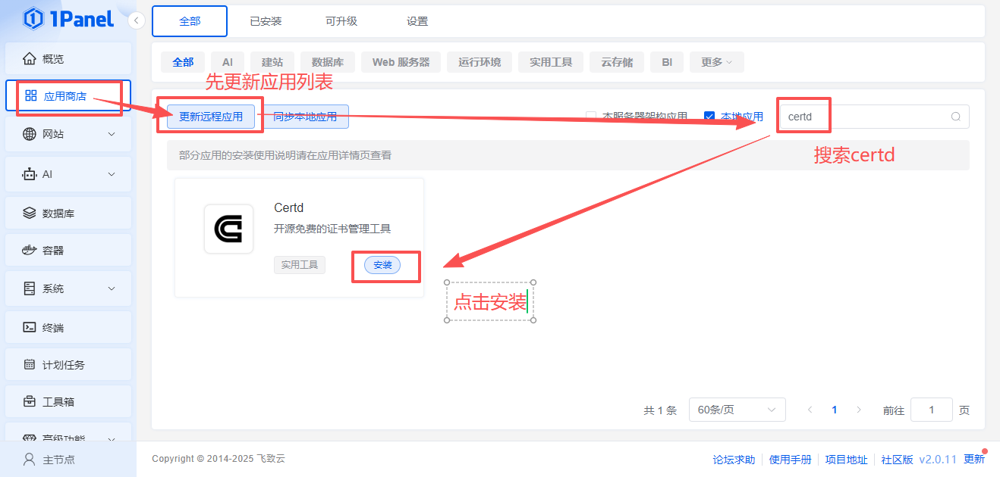
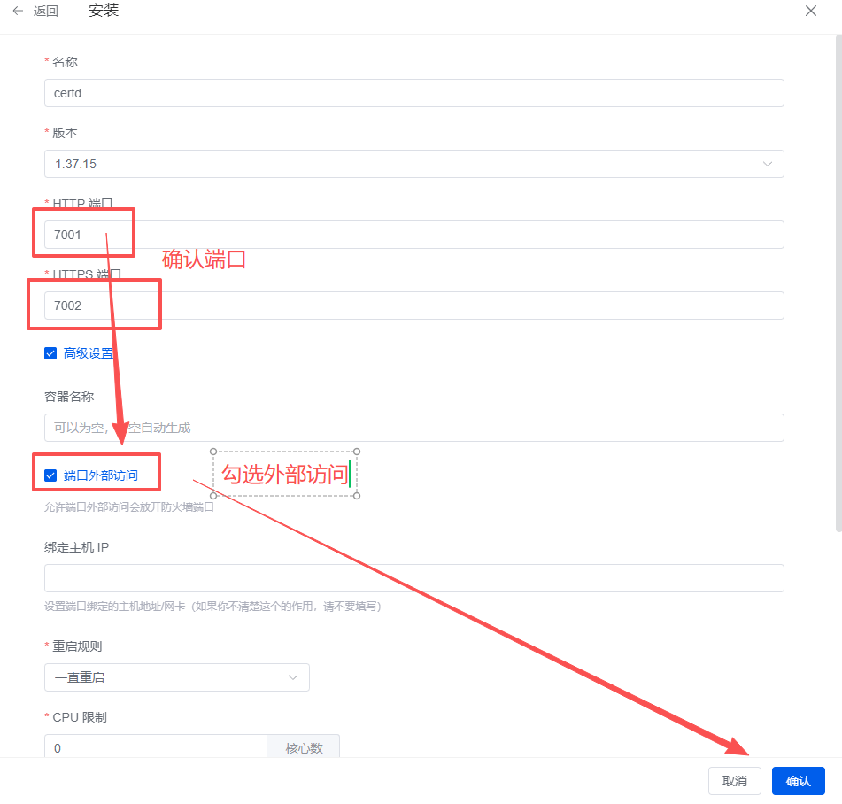
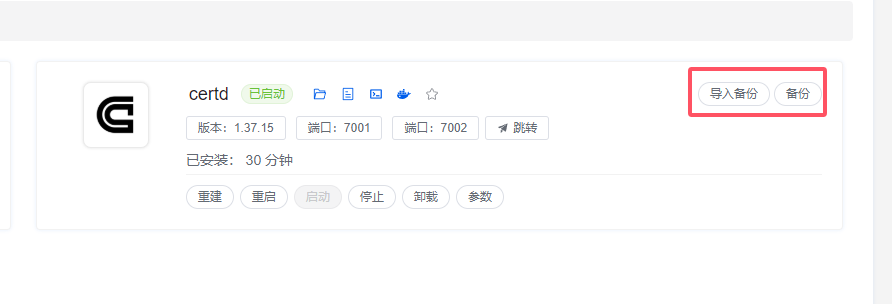

# 部署到1Panel面板

## 一、安装1Panel

https://1panel.cn/docs/installation/online_installation/

## 二、部署certd

有两种安装方式

### 1. 应用商店方式安装【推荐】

#### 1.1 安装
打开`1Panel->应用商店`，更新远程应用，搜索`certd`，点击安装

   

   

#### 1.2 访问测试：
http://ip:7001   
https://ip:7002   
默认账号密码      
admin/123456     
登录后请及时修改密码 

#### 1.3 备份
   

#### 1.4 恢复
 安装新Certd后，点击导入备份按钮，选择上面备份的文件即可

### 2. docker-compose方式安装

#### 2.1 安装
1. 打开`docker-compose.yaml`，整个内容复制下来    
   https://gitee.com/certd/certd/raw/v2/docker/run/docker-compose.yaml

::: tip
默认使用SQLite数据库，如果需要使用MySQL、PostgreSQL数据库，请参考[多数据库支持](./install/database.md)
:::

2. 然后到 `1Panel->容器->编排->新建编排`
   输入名称，粘贴`docker-compose.yaml`原文内容
   

3. 点击确定，启动容器   
   

> 默认使用sqlite数据库，数据保存在`/data/certd`目录下，您可以手动备份该目录   

#### 2.2 访问测试

http://ip:7001   
https://ip:7002   
默认账号密码      
admin/123456     
登录后请及时修改密码  

#### 2.3 升级

1. 找到容器，点击更多->升级
   

2. 选择强制拉取镜像，点击确认即可

#### 2.4 备份

> 默认数据保存在`/data/certd`目录下，可以手动备份    
> 建议配置一条 [数据库备份流水线](../../use/backup/)，自动备份

#### 2.5 恢复

将备份的`db.sqlite`及同目录下的其他文件一起覆盖到原来的位置，重启certd即可
