# 切换数据库

certd支持如下几种数据库：
1. sqlite3 (默认)
2. mysql 
3. postgresql
   
您可以按如下两种方式切换数据库


## 一、全新安装
::: tip   
以下按照`docker-compose`安装方式介绍如何使用mysql或postgresql数据库    
如果您使用其他方式部署，请自行修改对应的环境变量即可。   
:::

### 1.1、使用mysql数据库

1. 安装mysql，创建数据库 `(注意：charset=utf8mb4, collation=utf8mb4_bin)`
2. 下载最新的docker-compose.yaml
3. 修改环境变量配置
```yaml
services:
  certd:
    environment:
      # 使用mysql数据库，需要提前创建数据库 charset=utf8mb4, collation=utf8mb4_bin
      - certd_flyway_scriptDir=./db/migration-mysql                     # 升级脚本目录 【照抄】
      - certd_typeorm_dataSource_default_type=mysql                     # 数据库类型， 或者 mariadb 
      - certd_typeorm_dataSource_default_host=localhost                 # 数据库地址
      - certd_typeorm_dataSource_default_port=3306                      # 数据库端口
      - certd_typeorm_dataSource_default_username=root                  # 用户名
      - certd_typeorm_dataSource_default_password=yourpasswd            # 密码
      - certd_typeorm_dataSource_default_database=certd                 # 数据库名

```
4. 启动certd
```shell
docker-compose up -d
```


### 1.2、使用Postgresql数据库

1. 安装postgresql，创建数据库
2. 下载最新的docker-compose.yaml
3. 修改环境变量配置
```yaml
services:
  certd:
    environment:
      # 使用postgresql数据库，需要提前创建数据库
      - certd_flyway_scriptDir=./db/migration-pg                        # 升级脚本目录 【照抄】
      - certd_typeorm_dataSource_default_type=postgres                  # 数据库类型 【照抄】
      - certd_typeorm_dataSource_default_host=localhost                 # 数据库地址
      - certd_typeorm_dataSource_default_port=5433                      # 数据库端口
      - certd_typeorm_dataSource_default_username=postgres              # 用户名
      - certd_typeorm_dataSource_default_password=yourpasswd            # 密码
      - certd_typeorm_dataSource_default_database=certd                 # 数据库名

```
4. 启动certd
```shell
docker-compose up -d
```

## 二、从旧版的sqlite切换数据库

从旧版`sqlite`迁移到`mysql`或`postgresql`数据库

下面以 `SQLite` 转 `MySQL` 为例进行演示

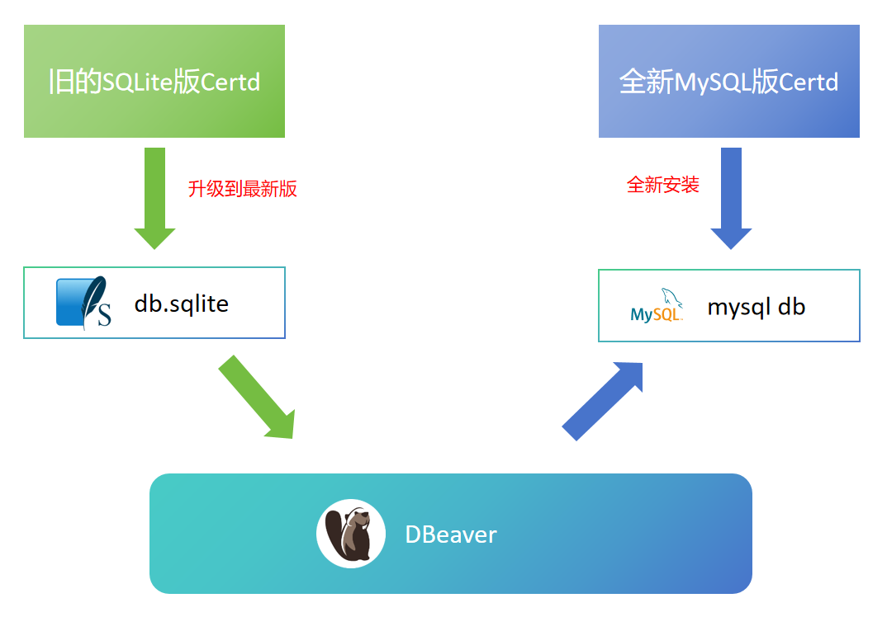

#### 0.前提条件： 
1. SQLite版Certd站点已经`升级到最新版` （`建议：备份sqlite数据库` ）
2. `全新安装`MySQL版本Certd（`确保是全新的，因为里面的数据会被清空覆盖`）
3. 两套Certd站点版本一致

#### 1. 安装DBeaver工具

[https://dbeaver.io/download/](https://dbeaver.io/download/)

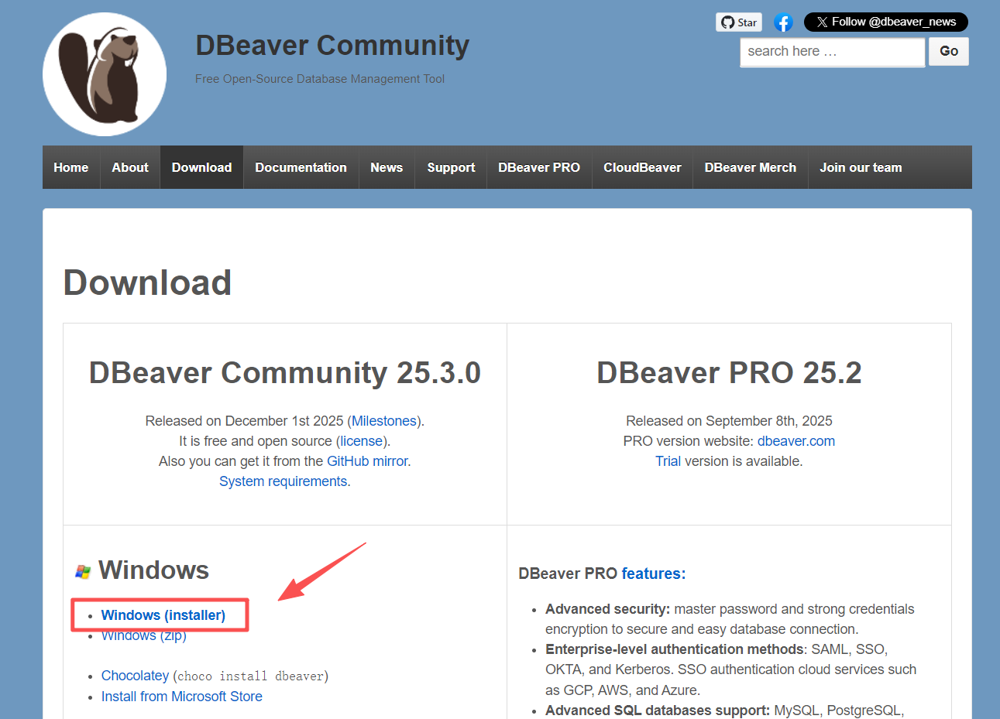

#### 2. 连接到sqlite数据库

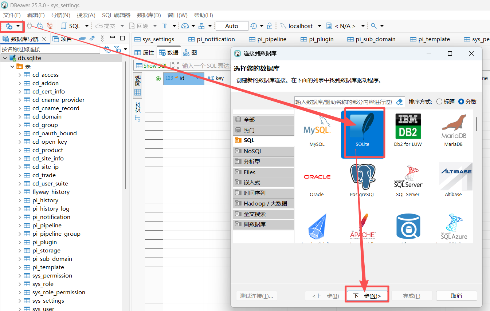

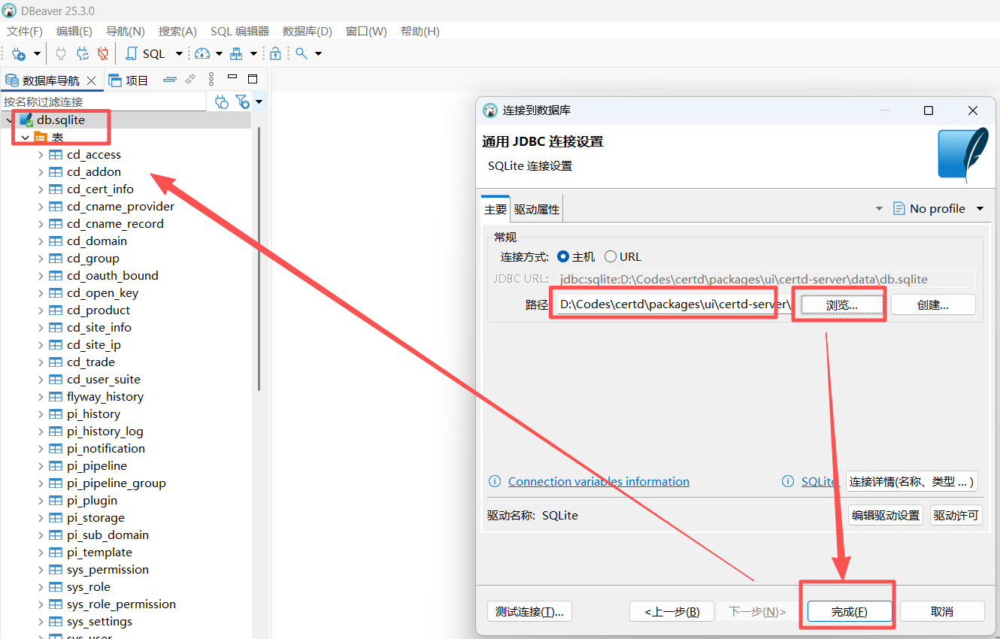

#### 3. 连接到mysql或postgresql数据库

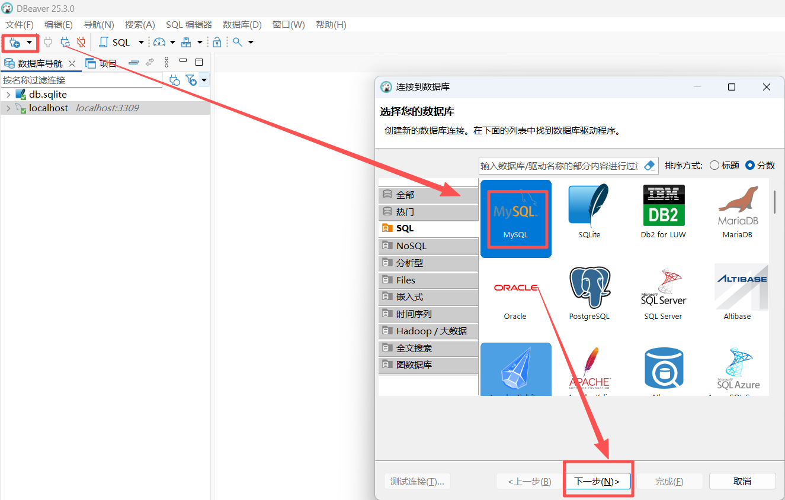

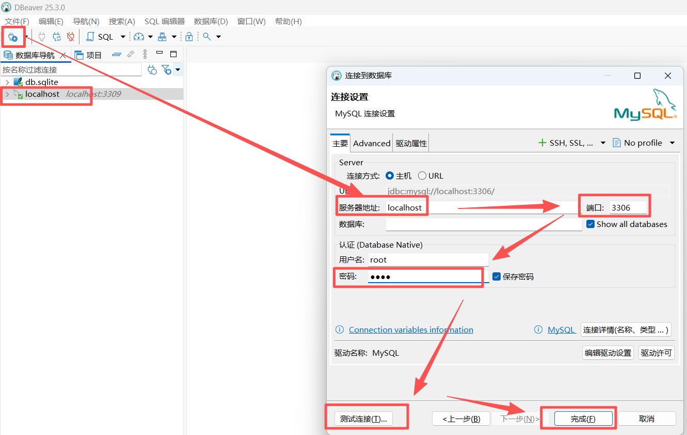


#### 4. 开始同步数据

选择mysql数据库，选择所有的表（`flyway_history除外`），右键导入数据

> 切记flyway_history数据表不要导入

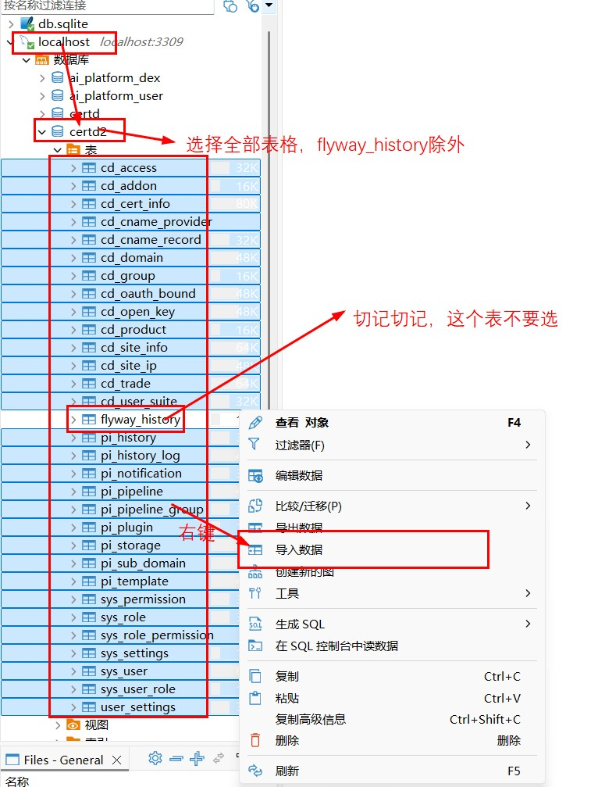
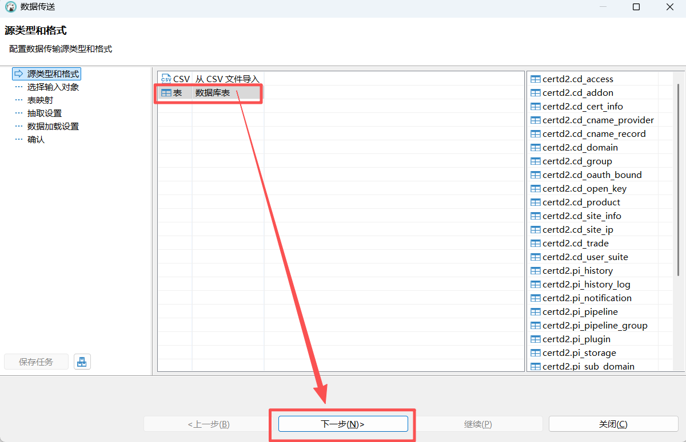
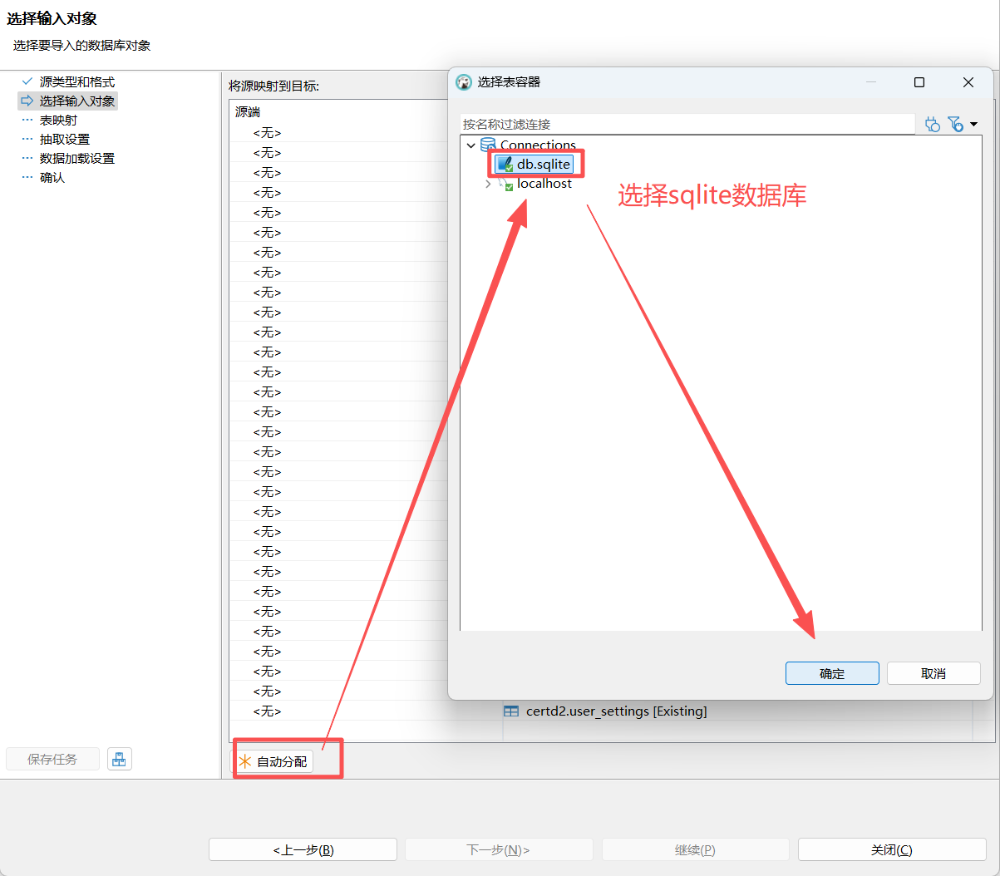
下一步、下一步，直到数据加载设置，勾选`在加载前截断目标表`（此选项很重要，并且会清空mysql certd数据库中的数据）
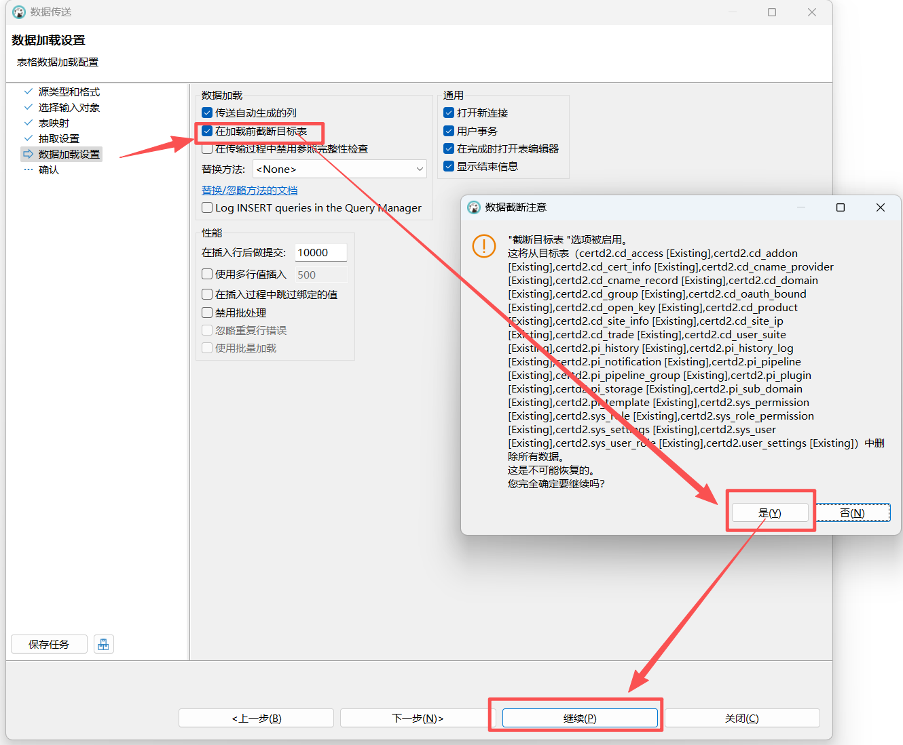

#### 5. 导入完成

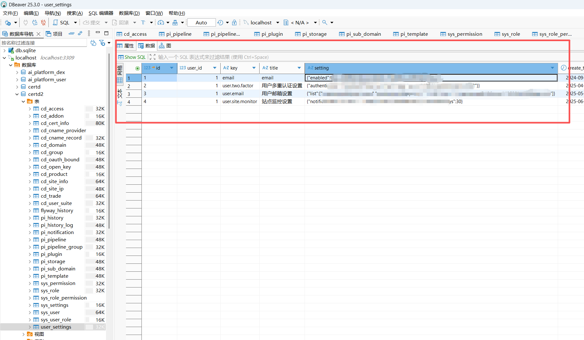

#### 6. 重启MySQL版本Certd

访问MySQL版本测试，数据已成功迁移     

确认没有问题之后，删除旧版certd