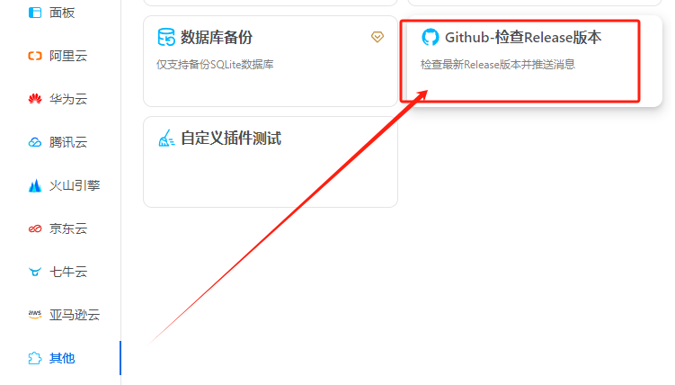
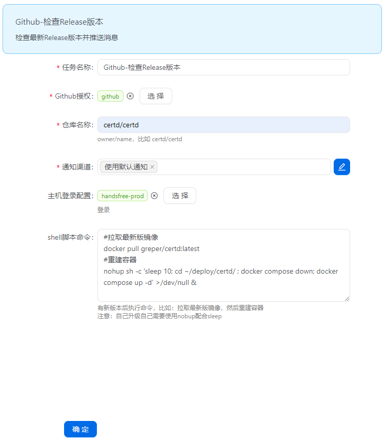

# 版本升级

## 升级方法
根据不同部署方式查看升级方法

1. [Docker方式部署升级](./docker/#二、升级)
2. [宝塔面板方式部署升级](./baota/#三、如何升级)
3. [1Panel面板方式部署升级](./1panel/#三、升级)
4. [源码方式部署](./source/#二、升级)

::: warning   
如果您是第一次升级certd版本，切记切记先备份一下数据    
:::

## 升级日志
可以查看最新版本号，以及所有版本的更新日志     
[CHANGELOG](../changelogs/CHANGELOG.md)


## 自动升级配置

### 1. 方法一：使用watchtower监控

修改docker-compose.yaml文件增加如下配置， 使用watchtower监控自动升级
```yaml
services:
  certd:
    ...
    labels:
      com.centurylinklabs.watchtower.enable: "true"

#         ↓↓↓↓ ---------------------------------------------------------  自动升级，上面certd的版本号要保持为latest
  certd-updater:  # 添加 Watchtower 服务
    image: containrrr/watchtower:latest
    container_name: certd-updater
    restart: unless-stopped
    volumes:
      - /var/run/docker.sock:/var/run/docker.sock
    # 配置 自动更新
    environment:
      - WATCHTOWER_CLEANUP=true            # 自动清理旧版本容器
      - WATCHTOWER_INCLUDE_STOPPED=false   # 不更新已停止的容器
      - WATCHTOWER_LABEL_ENABLE=true       # 根据容器标签进行更新
      - WATCHTOWER_POLL_INTERVAL=600       # 每 10 分钟检查一次更新

```


### 2. 方法二：使用Certd版本监控功能

选择Github-检查Release版本插件

按如下图填写配置



检测到新版本后执行宿主机升级命令：

```shell
# 拉取最新镜像
docker pull registry.cn-shenzhen.aliyuncs.com/handsfree/certd:latest
# 升级容器命令， 替换成你自己的certd更新命令
export RESTART_CERT='sleep 10; cd ~/deploy/certd/ ; docker compose down; docker compose up -d'
# 构造一个脚本10s后在后台执行，避免容器销毁时执行太快，导致流水线任务无法结束
nohup sh -c '$RESTART_CERT' >/dev/null  2>&1 & echo '10秒后重启' && exit
```