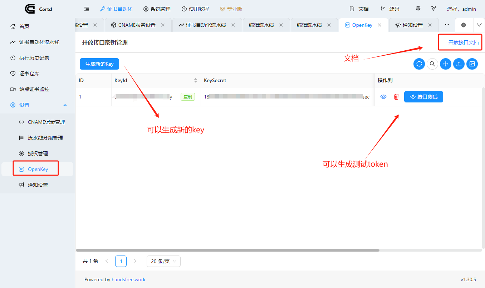

# 开放接口
被动方式对第三方提供证书， 支持根据域名或证书id获取证书。

## 获取keyId和KeySecret

## 接口文档

https://apifox.com/apidoc/shared-2e76f8c4-7c58-413b-a32d-a1316529af44/254949529e0

## Token生成方法

header中传入x-certd-token即可调用开放接口   
1、首先从OpenKey页面生成keyId，keySecret；    
2、准备一个content( json字符串)： content={"keyId":keyId, t:时间戳秒数, encrypt:false, signType:"md5"} `// encrypt返回结果是否加密`   
3、将content加上keySecret进行签名： sign = md5(content + keySecret)   
4、然后将content和sign分别base64后用.号连接： x-certd-token = base64(content) +"."+base64(sign)   

## SDK
待开发