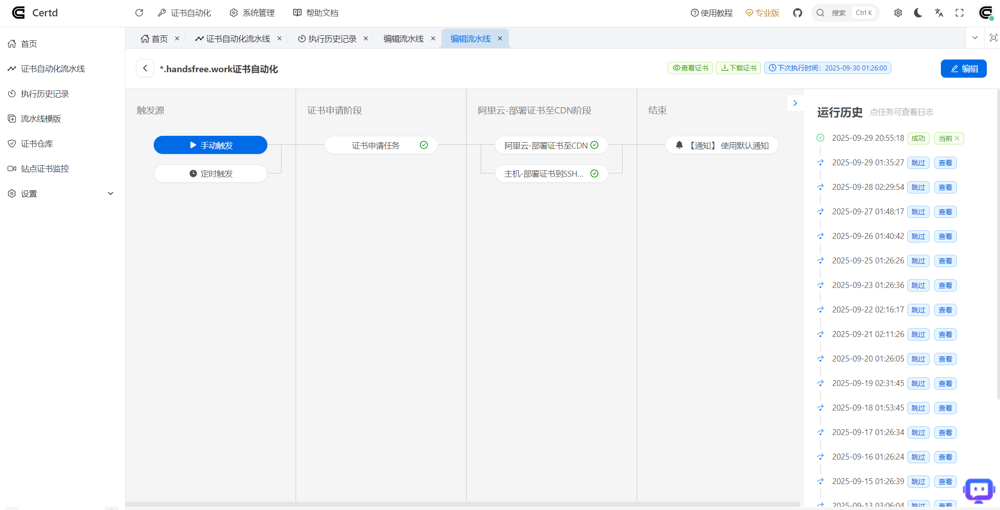

# 快速开始
本章节介绍如何快速开始使用`Certd`

## 一、 demo在线体验

官方DEMO地址，自助注册后体验

https://certd.handsfree.work/

注册 -> 创建证书流水线 -> 添加部署任务 -> 测试运行

> 注意demo的数据将不定期清理，生产使用请自行部署    
> 包含敏感信息，务必自己本地部署进行生产使用

## 二、私有化部署

由于证书、授权信息等属于高度敏感数据，请务必私有化部署，保障数据安全

###  1. 部署方式

1. [宝塔面板方式部署](./install/baota/)
2. [1Panel面板方式部署](./install/1panel/)
2. [Docker方式部署](./install/docker/)
3. [源码方式部署](./install/source/)

::: tip
默认安装使用SQLite数据库，如果需要使用MySQL、PostgreSQL数据库，请参考[多数据库支持](./install/database.md)
:::

### 2. 访问测试

http://your_server_ip:7001   
https://your_server_ip:7002    
默认账号密码：admin/123456    
记得修改密码

