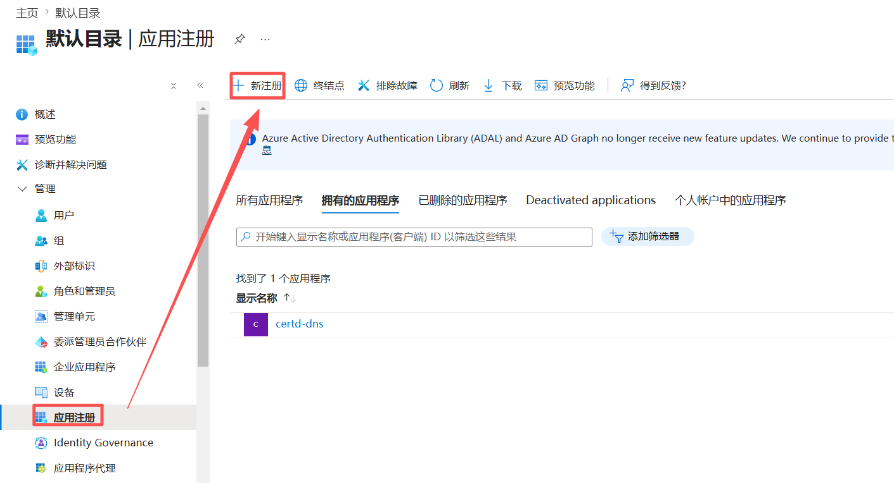
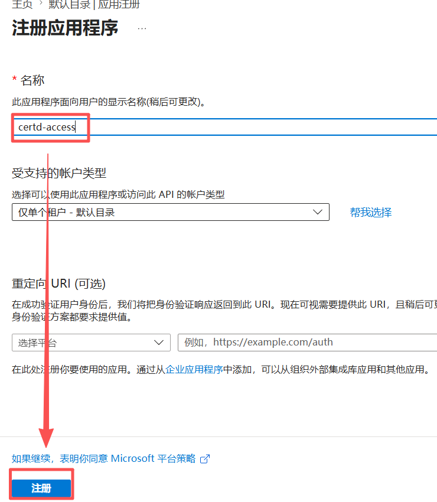
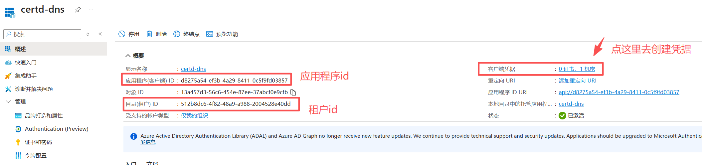
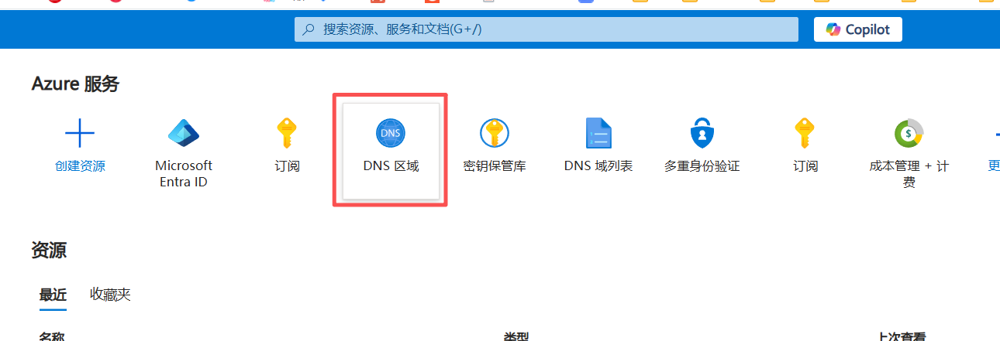
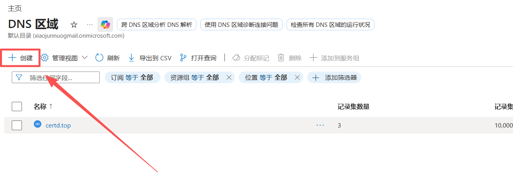
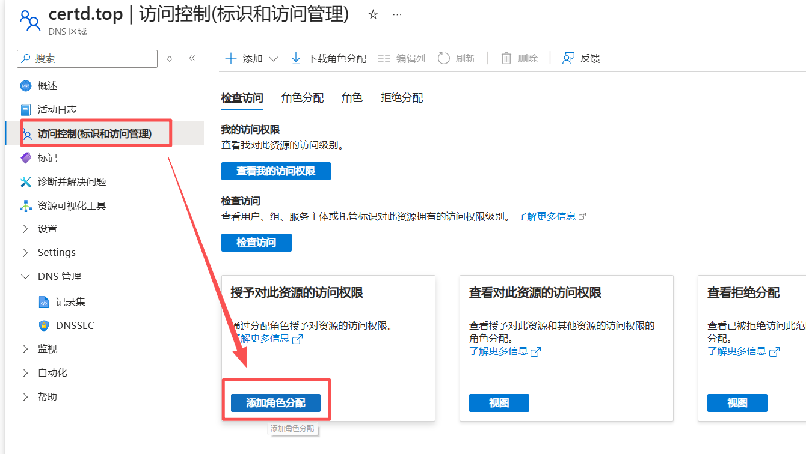
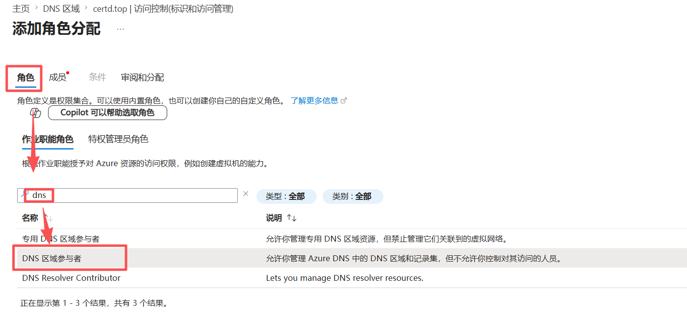
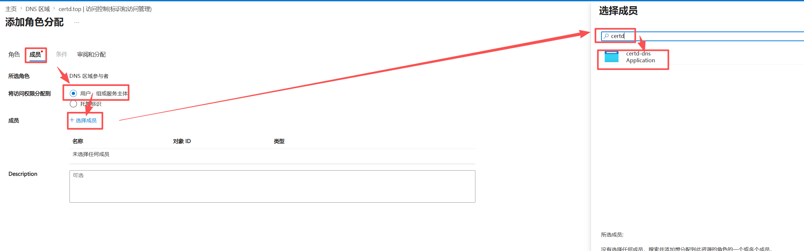

# Azure 配置

## Access授权配置

1. 登录 Azure 并创建一个资源组 【可选，如果已经有了可以不用创建】
2. 创建一个应用程序
Microsoft Entra ID - 》 应用注册 - 》 新注册

3. 配置授权

4. 点击测试

## Azure DNS 配置

1. 创建一个 DNS 区域(就是一个域名)

2. 为这个域名和上面创建的授权应用分配角色

3. 然后就可以给dns区域去申请证书了

