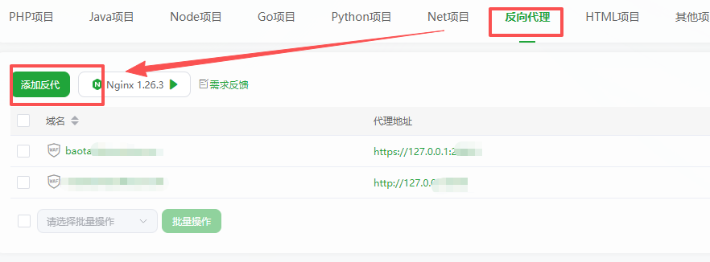
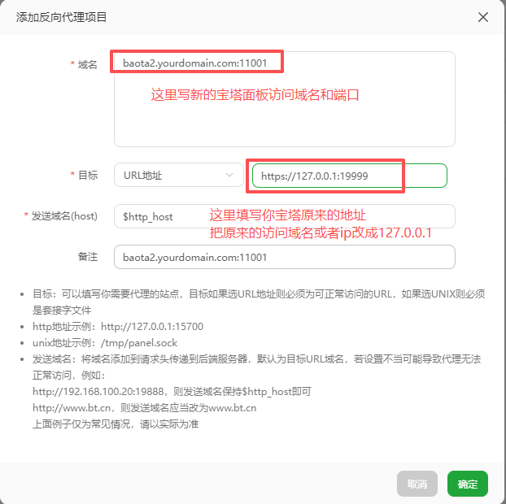
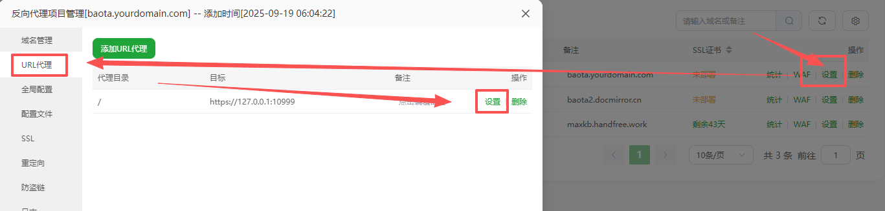
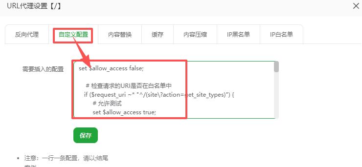
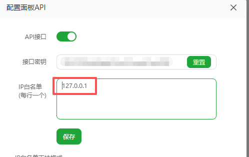
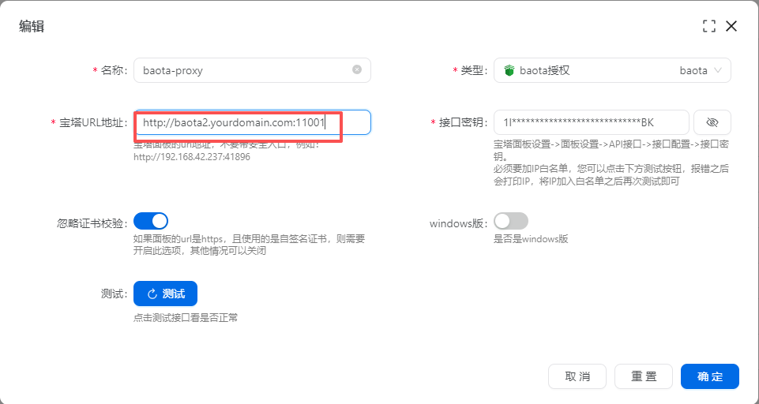
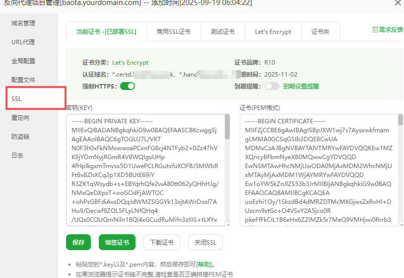
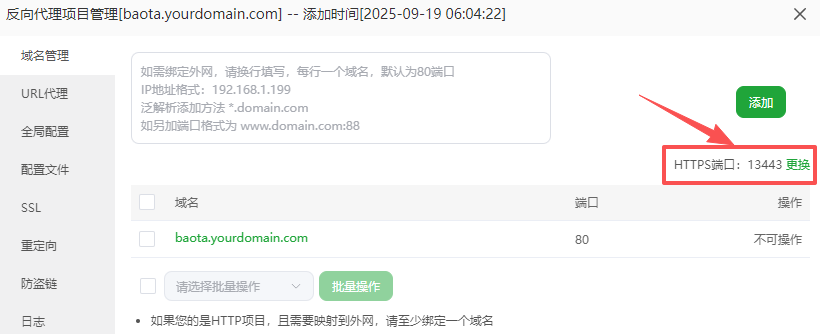

# 宝塔IP白名单与动态IP问题
调用宝塔接口需要添加IP白名单，但当certd部署在动态IP环境下时，IP白名单就不好添加
本章节提供两种解决方案：
1. 小范围网段放开（简单）
2. nginx代理

## 一、放开小范围网段

家庭网络IP虽然会变动，但是只会在小范围变的。

你可以分析规律，将变动的部分，设置成网段即可

> 比如出现过： 100.25.1.5 ， 100.25.1.8
>
> 那么你可以配置 100.25.1.1-100.25.1.255


> 如果出现过： 100.25.1.5 ， 100.25.4.8
>
> 可以尝试配置 100.25.*.5

## 二、nginx代理方案

通过在宝塔中配置一个nginx反向代理，代理宝塔自己的地址

然后在nginx中配置放开certd需要的接口，缩小影响范围

让nginx来充当防火墙

架构图如下：
```
                    只要将127.0.0.1加入白名单即可
                                ↓
certd --------> nginx -------> 宝塔
                  ↑
         拦截除更新证书之外的地址
```

### 1. 添加nginx反向代理


### 2. 域名和代理目标


### 3. 设置放开哪些接口


将如下脚本填入上方文本域中，保存
```nginx configuration
set $allow_access false;

    # 检查请求的URI是否在白名单中
   if ($request_uri ~* "^/(site\?action=get_site_types)") {
        # 允许测试
        set $allow_access true;
    }
    if ($request_uri ~* "^/(config\?action=SavePanelSSL)") {
        # 允许部署到宝塔面板本身证书
        set $allow_access true;
    }

    if ($request_uri ~* "^/(mod/docker/com/set_ssl|site\?action=SetSSL|ssl\?action=GetSiteDomain|mod/docker/com/get_site_list)") {
        # 允许部署宝塔网站证书
        set $allow_access true;
    }

    if ($request_uri ~* "^/(ssl?action=remove_cloud_cert|ssl\?action=get_cert_list)") {
        # 允许删除宝塔过期证书
        set $allow_access true;
    }

    if ($request_uri ~* "^/(datalist/get_data_list|site/set_site_ssl)") {
        set $allow_access true;
    }

    # 如果不在白名单，返回403禁止访问
    if ($allow_access = false) {
        return 405;
    }

```


### 4. 接口IP白名单添加127.0.0.1
   

### 5. certd中宝塔授权配置改成新的这个域名地址


点击测试检查是否ok ，到这里就可以正常部署证书了

### 6. 安全加强（将请求地址改成https）
在宝塔中配置证书部署任务，选择刚才新建的这个网站，给他部署证书
勾选强制https

更换443端口【可选】

禁止http访问
