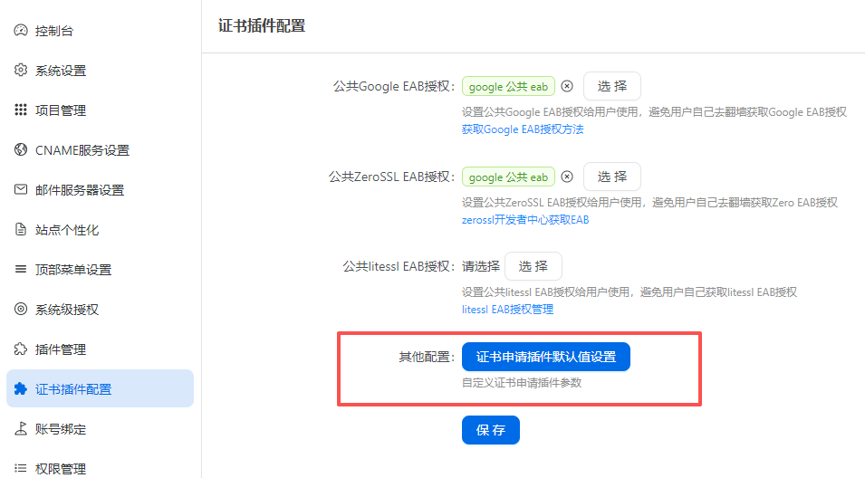
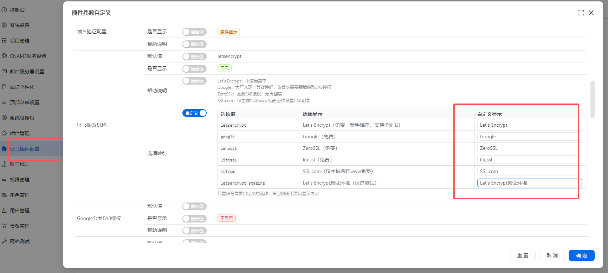

# 插件选项映射

商业版可以通过插件配置，自定义插件中下拉选择框的选项显示内容。

## 适用场景

插件中部分下拉选择框的选项可能带有"免费"、"测试"等字眼，商业版运营场景下需要隐藏或改写这些文字。

## 配置方式

1. 进入"系统管理" → "插件管理"
2. 找到需要配置的插件（如 CertApply 证书申请），点击"配置"按钮
3. 在"插件参数自定义"对话框中，找到带有下拉选项的参数（如"证书颁发机构"）
4. 该参数的配置行会多出一项"选项映射"，点击"自定义"

### 填写映射关系

系统会列出该下拉框的所有**选项值**和**原始显示内容**：

| 选项值 | 原始显示 | 自定义显示 |
|---|---|---|
| letsencrypt | Let's Encrypt（免费，新手推荐，支持IP证书） | [输入框] |
| google | Google（免费） | [输入框] |

- "自定义显示"一列为输入框，默认 placeholder 显示原始内容
- 只需填写**需要改写**的选项，留空的选项将保持原始显示
- 例如：将 Let's Encrypt（免费，新手推荐，支持IP证书） 改写为 Let's Encrypt

### 保存生效

填写完成后保存配置，用户在创建证书流水线时看到的选项文字即会变更为自定义内容。

