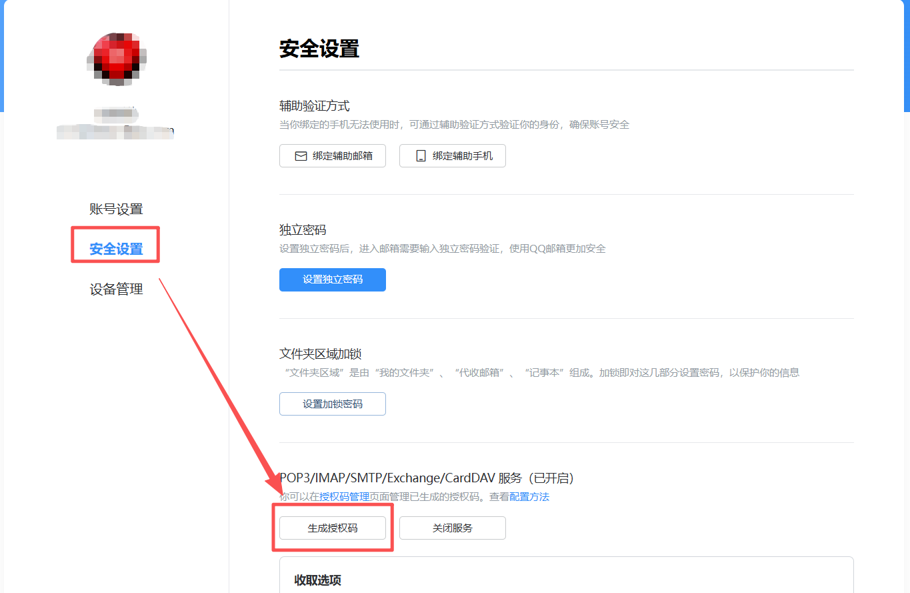

# 邮箱配置


## 腾讯企业邮箱配置
1. 开启smtp     

2. 获取授权码作为密码      


3. 填写域名、端口和密码        


## QQ邮箱配置
1. smtp配置
```yaml
smtp域名: smtp.qq.com
smtp端口: 465
密码: 授权码，获取方式见下方
是否SSL: 是
```

2. 获取授权码    
登录qq邮箱，点击账号与安全   

   
