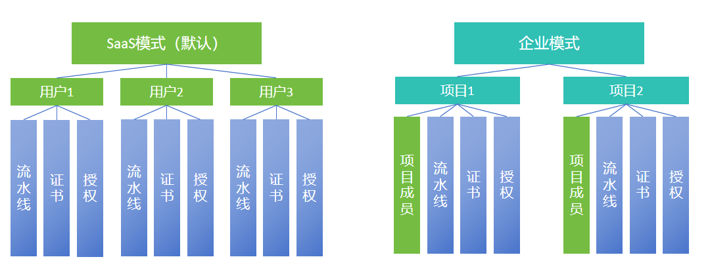
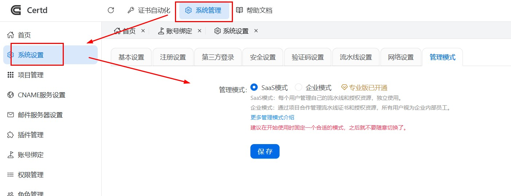
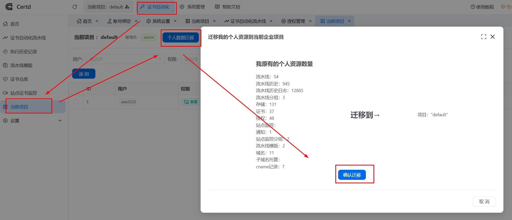
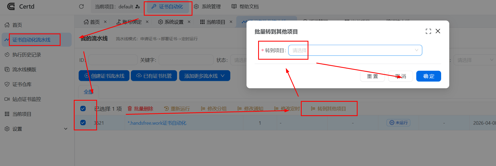

# 企业模式（项目管理）

## 模式简介
Certd支持两种管理模式，`SaaS模式（默认）`和`企业模式`。

## SaaS模式
* 默认的模式，每个用户管理自己的流水线和授权资源，每个用户独立使用。    
* Certd系统作为SaaS提供证书自动申请部署服务，您的客户注册即可使用，无需自己部署

## 企业模式

* 通过项目合作管理流水线证书和授权资源，所有用户视为企业内部员工。

* 当你想在企业内部使用，企业内部有多个项目，各个项目成员共同管理项目资源和证书时可以启用此模式

* 需要在"系统设置->管理模式"中开启`企业模式`

::: warning
* 建议在开始使用时固定一个合适的模式，之后就不要随意切换了。
* 商业版不能使用企业模式，因为商业版提供功能价值在于SaaS服务，与企业模式冲突   
:::

###  数据迁移
模式之间数据不互通，您可以通过个人数据迁移功能将数据转到项目之下

####  个人数据迁移到项目
注意：此操作不可逆，请谨慎操作

####  流水线数据转到其他项目
项目之间流水线数据可以转移，依赖的授权数据会同步复制一份   

