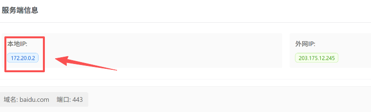

# 群晖部署和证书更新

支持群晖`6.x`、`7.x`

## 一、群晖部署Certd

以下是群晖`7.x`的部署`certd`步骤。   
群晖`6.x`请参考[docker部署](./../../install/docker/)

### 1. 打开Container Manager


### 2. 新增项目


### 3. 配置Certd项目


建议加上 `:delegated` 提升性能
```yaml
  volumes:
                                          ↓↓↓↓------加上这个提升性能
    - /volume1/docker/certd:/app/data:delegated
```

### 4. 外网访问设置


### 5. 确认项目信息


点击完成安装，等待certd启动完成即可

### 6. 门户配置向导【可选】


## 二、更新群晖证书

证书部署插件支持群晖`6.x`、`7.x`

## 1. 前提条件
* 已经部署了certd
* 群晖上已经设置好了证书(证书建议设置好描述，插件需要根据描述查找证书)

## 2. 在certd上配置自动更新群晖证书插件


## 3. 配置任务参数


## 4. 创建授权

> 注意群晖上要做两个设置   


## 5. 运行部署
点击手动运行即可


## 6. 配置通知和自动运行


## 三、 常见问题

### 1. 登录超时 status:ECONNABORTED
如果您的certd部署在群晖里面，可能会遇到登录超时的问题
```
httpRequest:https://dms.xxxxx.com:5001/webapi/entry.cgi, method:get
请求出错: status:ECONNABORTED, statusText:ECONNABORTED
Axio:sError: timeout of 120000ms exceeded
```
可能的原因是是您的dsm域名指向的局域网地址在容器内无法访问，导致登录超时

你可以通过配置 域名映射来解决
1. 获取群晖dsm内部地址
  进入certd后台->系统管理->网络测试，  一般会看到 `172.xx.0.2` ，记住这个xx是多少


2. 修改容器编排 docker-compose.yaml

```
services:
  certd:
    ...
    extra_hosts:   # 放开这段注释
       - "你的dsm域名地址:172.xx.0.1" #  将xx替换成上面记住的数字
```
